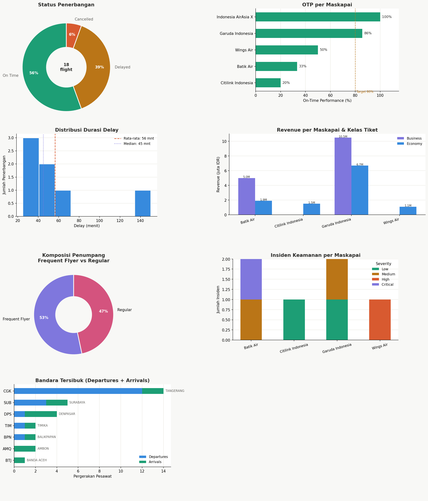

# Portofolio Data Analyst: Operasional Penerbangan Domestik Indonesia


**Tools:** PostgreSQL | **Level:** Intermediate–Advanced  
**Fokus:** Data Cleaning · JOIN · Subquery · CTE · Window Functions

---

## Deskripsi Proyek

Proyek ini mensimulasikan pekerjaan seorang Data Analyst di divisi **Operations Intelligence** maskapai penerbangan domestik Indonesia.

Dataset mencakup **5 entitas** yang saling berkaitan:
- **Bandara** (airports) — 19 bandara se-Indonesia
- **Maskapai** (airlines) — GA, QG, ID, IW, SJ, XT, dll.
- **Penerbangan** (flights) — data jadwal, actual, delay, status
- **Penumpang** (passengers) — tiket, kelas, harga, frequent flyer
- **Insiden** (incidents) — tipe, severity, resolusi

---

## Struktur File SQL

```
aviation_portfolio.sql
│
├── BAGIAN 1 — Raw Data (Data Kotor)
│   Semua tabel raw sengaja dibuat kotor untuk proses cleaning:
│   - Duplikat record
│   - Inkonsistensi nilai (yes/YES/1/true/Y)
│   - Format campuran (delay: '-5', 'N/A', null)
│   - Referensi FK tidak valid
│   - Typo dan spasi berlebih
│
├── BAGIAN 2 — Data Cleaning
│   2A. clean_airports  — dedup, normalisasi IATA, parse koordinat
│   2B. clean_airlines  — dedup, ekstrak fleet_size dari teks
│   2C. clean_flights   — normalisasi status, fix delay negatif, filter FK valid
│   2D. clean_passengers — dedup, standardisasi gender & kelas, parse harga (Rp)
│   2E. clean_incidents — dedup, normalisasi severity & resolved, filter FK valid
│
├── BAGIAN 3 — JOIN Queries
│   3A. Multi-table JOIN (flights + airlines + 2x airports)
│   3B. LEFT JOIN (flights dengan/tanpa insiden)
│   3C. 4-table JOIN untuk analisis pendapatan maskapai
│
├── BAGIAN 4 — Subqueries
│   4A. Subquery di WHERE (delay > rata-rata)
│   4B. Derived Table / Subquery di FROM (ranking ketepatan waktu)
│   4C. Correlated Subquery (total insiden per maskapai)
│
├── BAGIAN 5 — CTEs
│   5A. CTE Berantai 3 tingkat (statistik rute → enrich → klasifikasi)
│   5B. Recursive CTE (hierarki hub-spoke jaringan bandara)
│   5C. CTE + Window Functions (analisis revenue & penumpang premium)
│
└── BAGIAN 6 — Business Insights
    6A. Dashboard KPI operasional
    6B. Bandara tersibuk (UNION + Window)
    6C. Safety analysis (PIVOT manual dengan CASE WHEN)
```

---

## Masalah Data yang Diselesaikan

| Masalah | Teknik Cleaning | Tabel |
|---------|----------------|-------|
| Kode IATA huruf kecil/campur | `UPPER(TRIM(...))` | airports, airlines, flights |
| Duplikat record | `ROW_NUMBER() OVER (PARTITION BY ...)` | semua tabel |
| `is_international`: yes/YES/1/true/Y | `CASE WHEN LOWER(...)` | airports |
| `fleet_size`: '~120', 'sekitar 50' | `REGEXP_MATCH` | airlines |
| Delay negatif (-5 menit) | `CASE WHEN ... < 0 THEN 0` | flights |
| Delay 'N/A' | `CASE WHEN ~ regex THEN ... ELSE NULL` | flights |
| Status: 'OT','ONTIME','on time' | CASE normalisasi | flights |
| Harga tiket: 'Rp 1.200.000', '1,200,000' | `REGEXP_REPLACE` | passengers |
| Gender: 'L','M','Laki','laki-laki' | CASE normalisasi | passengers |
| Kelas tiket: 'ECO','BIZ','C','ekonomi' | CASE normalisasi | passengers |
| Severity: '2','CRITICAL','High' | CASE normalisasi | incidents |
| FK tidak valid (airline/airport tidak ada) | `INNER JOIN` saat cleaning | flights |
| Referensi flight_id tidak ada | `INNER JOIN clean_flights` | incidents |

---

## Teknik SQL yang Digunakan

### JOIN
```sql
-- 4 tabel sekaligus
FROM clean_flights cf
JOIN clean_airlines  ca ON cf.airline_iata = ca.iata_code
JOIN clean_airports  ao ON cf.origin_iata  = ao.iata_code   -- alias berbeda
JOIN clean_airports  ad ON cf.destination_iata = ad.iata_code
LEFT JOIN clean_incidents ci ON cf.flight_id = ci.flight_id -- optional join
```

### Subquery
```sql
-- Scalar subquery dalam WHERE
WHERE cf.delay_minutes > (SELECT AVG(delay_minutes) FROM ...)

-- Derived table dalam FROM
FROM (SELECT airline_name, COUNT(*) ... GROUP BY ...) AS summary

-- Correlated subquery (referensi tabel luar)
(SELECT COUNT(*) FROM incidents i2 
 JOIN flights cf2 ON ... WHERE cf2.airline_iata = cf.airline_iata)
```

### CTE
```sql
WITH cte1 AS (...),
     cte2 AS (SELECT ... FROM cte1 JOIN ...),   -- CTE berantai
     cte3 AS (SELECT ... FROM cte2)              -- lapisan ketiga
SELECT * FROM cte3;
```

### Recursive CTE
```sql
WITH RECURSIVE hub_network AS (
    SELECT ... WHERE iata_code = 'CGK'           -- base case
    UNION ALL
    SELECT ... FROM hub_network JOIN ...          -- recursive step
    WHERE hub_level < 2                           -- stopping condition
)
```

### Window Functions
```sql
RANK() OVER (ORDER BY total_revenue DESC)
SUM(total_revenue) OVER ()                       -- grand total
ROUND(100.0 * revenue / SUM(revenue) OVER (), 1) -- percentage of total
```

---

## Cara Menjalankan

### Prasyarat
- PostgreSQL 13+ (direkomendasikan 14 atau 15)
- psql CLI atau pgAdmin / DBeaver

### Langkah
```bash
# Buat database baru
createdb aviation_indonesia

# Jalankan file SQL
psql -d aviation_indonesia -f aviation_portfolio.sql

# Atau copy-paste per bagian di pgAdmin / DBeaver
```

### Urutan Eksekusi yang Disarankan
1. Jalankan **Bagian 1** seluruhnya (buat semua tabel raw)
2. Jalankan **Bagian 2** seluruhnya (buat semua tabel clean)
3. Jalankan query **Bagian 3–6** satu per satu, amati hasilnya

---

## Dataset Unik: Kenapa Penerbangan Domestik Indonesia?

- **Kompleksitas geografis**: 17.000+ pulau = jaringan rute unik
- **Variasi maskapai**: dari Garuda (full service) hingga Wings Air (turboprop perintis)
- **Regulasi khusus**: DGCA (Direktorat Jenderal Perhubungan Udara) punya standar berbeda
- **Data realisme**: Kode IATA, nama bandara, rute — semuanya nyata
- **Relevansi bisnis**: Delay, safety, load factor = KPI standar industri

---

## Insight Bisnis yang Dihasilkan

1. **On-Time Performance (OTP)** per maskapai dan rute
2. **Revenue breakdown** Economy vs Business per penerbangan
3. **Bandara tersibuk** berdasarkan total pergerakan pesawat
4. **Safety risk ranking** maskapai berdasarkan severity insiden
5. **Hub-spoke network** dua lapis dari Soekarno-Hatta
6. **Data Quality Report** — berapa % data yang kotor di setiap tabel

---
